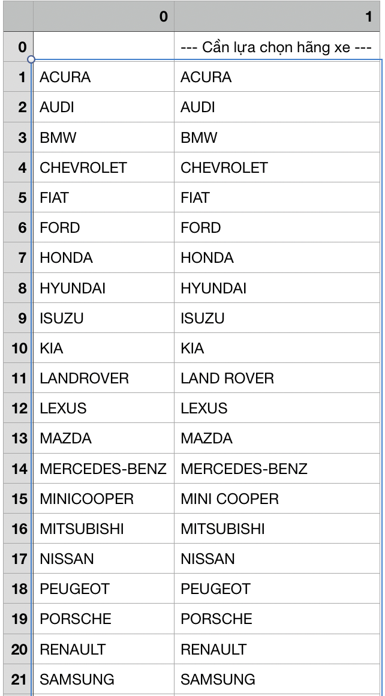

# extract select option with atribute and text value content to csv tool
Công cụ trích xuất select option của html với value và text thành csv 

Trong thư mục đang làm việc (in working dir)
``
pip install -r requirements.txt
``

## open html_parser_to_text.py file 

mở file html_parser_to_text.py pate thay đổi nội dung của biến ``ht_ml `` thành đoạn html của bạn ví dụ như mẫu ở dưới đây, kết quả sau khi chạy xong sẽ được 1 file ``csv`` tên là ``file.csv``

```python
ht_ml = """
<select name="ctl00$MainContent$Cbohangxe" onchange="javascript:setTimeout('__doPostBack(\'ctl00$MainContent$Cbohangxe\',\'\')', 0)" id="MainContent_Cbohangxe" class="form-control">
	<option selected="selected" value="">--- Cần lựa chọn hãng xe ---</option>
	<option value="ACURA">ACURA</option>
	<option value="AUDI">AUDI</option>
	<option value="BMW">BMW</option>
	<option value="CHEVROLET">CHEVROLET</option>
	<option value="FIAT">FIAT</option>
	<option value="FORD">FORD</option>
	<option value="HONDA">HONDA</option>
	<option value="HYUNDAI">HYUNDAI</option>
	<option value="ISUZU">ISUZU</option>
	<option value="KIA">KIA</option>
	<option value="LANDROVER">LAND ROVER</option>
	<option value="LEXUS">LEXUS</option>
	<option value="MAZDA">MAZDA</option>
	<option value="MERCEDES-BENZ">MERCEDES-BENZ</option>
	<option value="MINICOOPER">MINI COOPER</option>
	<option value="MITSUBISHI">MITSUBISHI</option>
	<option value="NISSAN">NISSAN</option>
	<option value="PEUGEOT">PEUGEOT</option>
	<option value="PORSCHE">PORSCHE</option>
	<option value="RENAULT">RENAULT</option>
	<option value="SAMSUNG">SAMSUNG</option>
	<option value="SUZUKI">SUZUKI</option>
	<option value="THACO">THACO</option>
	<option value="TOYOTA">TOYOTA</option>
	<option value="VOLKSWAGEN">VOLKSWAGEN</option>
</select>
"""
```

## run 

``
python html_parser_to_text.py 
``

## kết quả sau khi chạy 



## requairememnts 

```
asgiref==3.2.3
numpy==1.18.1
pandas==0.25.3
python-dateutil==2.8.1
pytz==2019.3
six==1.13.0
sqlparse==0.3.0

```